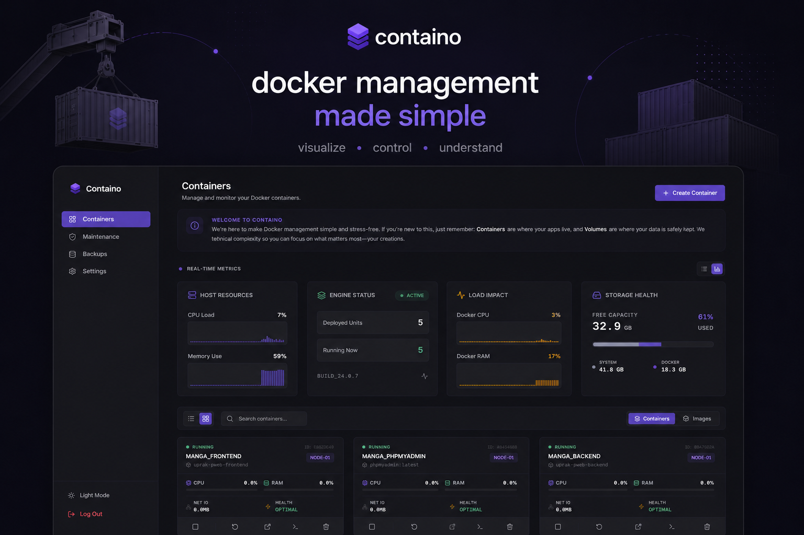

# Containo



Containo is a lightweight and beginner-friendly Docker management dashboard. Unlike heavy enterprise tools, Containo is designed specifically for students and developers who are new to Docker and want a simple, intuitive way to monitor their containers without getting lost in complex configurations.


---

## Why Containo?

- **Simple & Focused**: No cluttered menus. Just the essential tools you need to manage your containers.
- **Learning Friendly**: A great starting point for those who want to see how Docker works visually.
- **Plug & Play**: Zero-configuration setup means you can get it running in seconds.

---

## Key Features

- **Zero-Config Security**: No need to worry about complex security setups. Containo automatically generates a secure access key for you on the first run.
- **Real-time Monitoring**: See your container's CPU and RAM usage live via WebSockets—no page refreshes required.
- **Easy Management**: Start, stop, and restart containers with a single click.
- **Minimalist Design**: A clean, modern UI with dark mode support, making it easy on the eyes during late-night coding sessions.

---

## Technology Stack

- **Framework**: [Next.js](https://nextjs.org/) (App Router)
- **Language**: [TypeScript](https://www.typescriptlang.org/)
- **Docker Integration**: [Dockerode](https://github.com/apocas/dockerode)
- **Real-time Engine**: [ws](https://github.com/websockets/ws) (WebSockets)
- **Database**: [Better-SQLite3](https://github.com/WiseLibs/better-sqlite3)

---

## Getting Started

Follow these steps to get Containo running on your machine:

### 1. Clone the Repository
First, clone the project to your local machine:
```bash
git clone https://github.com/username/containo.git
cd containo
```

### 2. Run with Docker Compose (Recommended)
The easiest way to run Containo is using Docker Compose, which will build the image locally for you:

```yaml
services:
  containo:
    build: .
    container_name: containo
    ports:
      - "3611:3611"
    environment:
      - NODE_ENV=production
    volumes:
      - /var/run/docker.sock:/var/run/docker.sock
      - ./data:/app/data
    restart: always
```

Simply run:
```bash
docker-compose up -d --build
```

### 3. Manual Installation (Node.js)
If you prefer to run it directly without Docker:

1. **Install Dependencies**:
   ```bash
   pnpm install
   ```

2. **Build & Start**:
   ```bash
   pnpm run build
   pnpm run start
   ```
   Access the dashboard at `http://localhost:3611`.

---

## Security Note

For ease of use, if you don't provide a `JWT_SECRET` in your environment variables, Containo will automatically generate one and save it in `data/.jwt_secret`. This ensures your dashboard is protected even if you forget to set a password.

---

**Containo** - *Docker management, made simple for everyone.*
