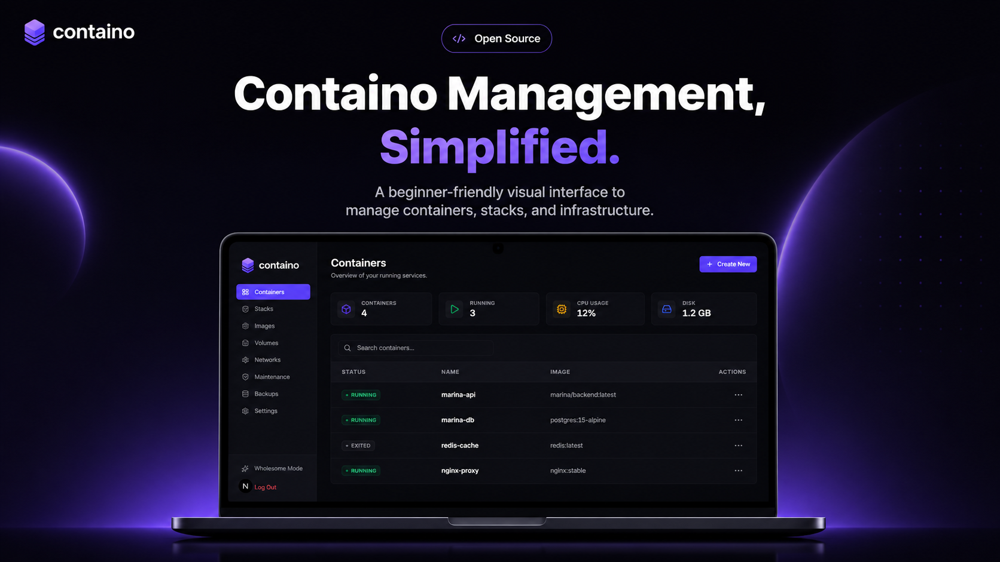
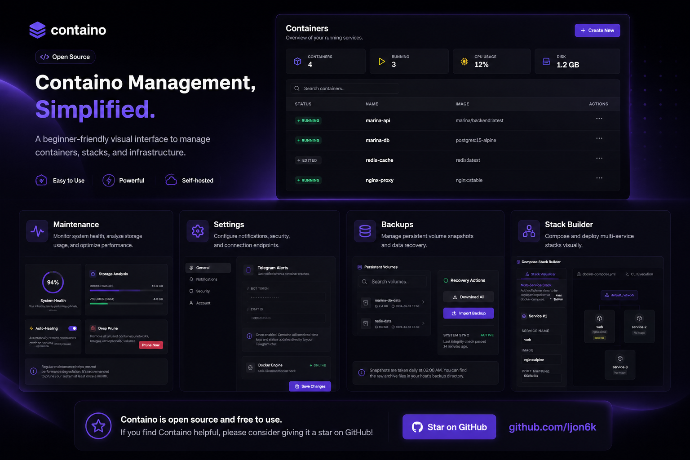

# Containo

A minimalist and modern Docker management dashboard designed to simplify container orchestration for developers of all levels. 

> **Status: Work In Progress (Coming Soon)**  
> Containo is currently under active development. Installation instructions and documentation will be provided once the initial stable release is ready.

## Overview

Containo aims to replace complex terminal commands and cluttered interfaces with a clean, intuitive, and highly responsive web dashboard. Built for individual developers and small teams, it provides a seamless way to manage, monitor, and deploy Docker environments without the steep learning curve.

## Core Features

- **Intuitive Dashboard:** Get a clear overview of all your running and stopped containers at a glance.
- **Visual Stack Builder:** A dedicated split-view interface to easily configure multi-service `docker-compose` stacks, complete with a real-time stack visualizer and YAML generator.
- **Resource Monitoring:** Direct, lightweight monitoring for container metrics (CPU, Memory, Block I/O) directly from the dashboard.
- **Themeable UI:** Built on a robust CSS variable design system with support for Light, Dark, and custom themes.
- **Frictionless Management:** Start, stop, delete, and view logs for containers with just a few clicks.

## Tech Stack

- **Frontend:** Next.js, React
- **Styling:** Tailwind CSS
- **Animations:** Framer Motion
- **Icons:** Lucide React

---

*Stay tuned for updates.*
