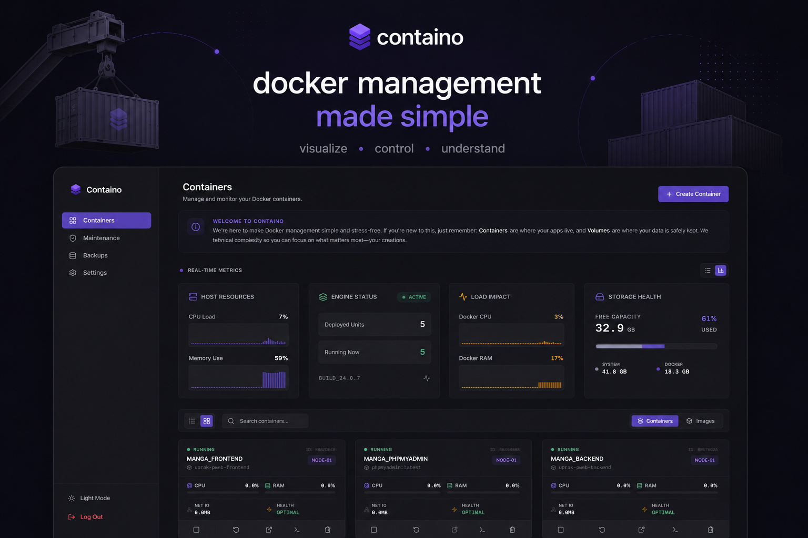

# Containo



Containo is a lightweight and beginner-friendly Docker management dashboard. Unlike heavy enterprise tools, Containo is designed specifically for students and developers who are new to Docker and want a simple, intuitive way to monitor their containers without getting lost in complex configurations.


---

## Why Containo?

- **Simple & Focused**: No cluttered menus. Just the essential tools you need to manage your containers.
- **Learning Friendly**: A great starting point for those who want to see how Docker works visually.
- **Plug & Play**: Zero-configuration setup means you can get it running in seconds.

---

## Key Features

- **Zero-Config Security**: No need to worry about complex security setups. Containo automatically generates a secure access key for you on the first run.
- **Real-time Monitoring**: See your container's CPU and RAM usage live via WebSockets—no page refreshes required.
- **Easy Management**: Start, stop, and restart containers with a single click.
- **Minimalist Design**: A clean, modern UI with dark mode support, making it easy on the eyes during late-night coding sessions.

---

## Technology Stack

- **Framework**: [Next.js](https://nextjs.org/) (App Router)
- **Language**: [TypeScript](https://www.typescriptlang.org/)
- **Docker Integration**: [Dockerode](https://github.com/apocas/dockerode)
- **Real-time Engine**: [ws](https://github.com/websockets/ws) (WebSockets)
- **Database**: [Better-SQLite3](https://github.com/WiseLibs/better-sqlite3)

---

## Getting Started

Follow these steps to get Containo running on your machine:

### 1. Run with Docker (Recommended)
You can run Containo directly from the terminal without cloning the project:
```bash
docker run -d \
  --name containo \
  --restart unless-stopped \
  -p 3611:3611 \
  -v /var/run/docker.sock:/var/run/docker.sock \
  -v containo-data:/app/data \
  -e DOCKER_HOST=unix:///var/run/docker.sock \
  ijon6k/containo:latest
```

### 2. Run with Docker Compose
If you prefer Docker Compose, save the following as `docker-compose.yml` in an empty directory:
```yaml
services:
  containo:
    image: ijon6k/containo:latest
    container_name: containo
    ports:
      - "3611:3611"
    volumes:
      - /var/run/docker.sock:/var/run/docker.sock
      - containo-data:/app/data
    environment:
      - DOCKER_HOST=unix:///var/run/docker.sock
    restart: unless-stopped

volumes:
  containo-data:
```
Then run:
```bash
docker compose up -d
```

### 3. Run from Source (Development)
If you want to run it from the source code:

1. **Clone the Repository**:
   ```bash
   git clone https://github.com/Ijon6k/containo.git
   cd containo
   ```

2. **Option A: Run with Docker Compose (Local Build)**:
   ```bash
   docker-compose up -d --build
   ```

3. **Option B: Manual Installation (Node.js)**:
   - Install Dependencies:
     ```bash
     pnpm install
     ```
   - Build & Start:
     ```bash
     pnpm run build
     pnpm run start
     ```

Access the dashboard at `http://localhost:3611`.

---

## Security Note

For ease of use, if you don't provide a `JWT_SECRET` in your environment variables, Containo will automatically generate one and save it in `data/.jwt_secret`. This ensures your dashboard is protected even if you forget to set a password.

---

**Containo** - *Docker management, made simple for everyone.*
